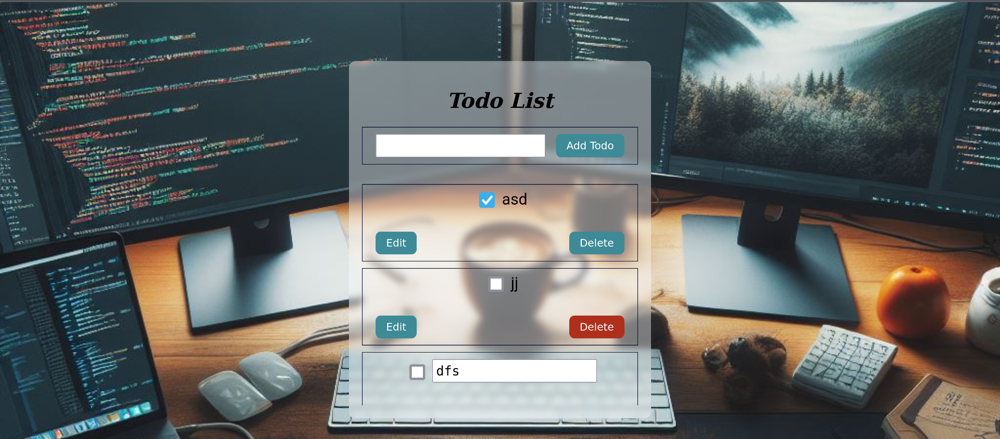

# Reporte TO-DO

Se realizó la práctica del tutorial en el que hicimos un to-do list. Seguimos paso a paso las indicaciones que se indicaron en el tutorial. En él, pudimos ver el manejo de los componentes y el uso de los hooks para poder guardar el estado de la aplicación en el local storage. Puedes acceder al tutorial a través de este enlace: [https://acortar.link/2cbbrE](https://acortar.link/2cbbrE).

El tutorial cuenta con el siguiente contenido: agregar un nuevo elemento a la lista de tareas, agregar un check para marcar la tarea como realizada, agregar un botón para eliminar la tarea y poder editar la tarea. Al final, se le agregó un estilo personalizado a la lista.

## conclusion
Me pareció interesante, anteriormente no sabía que el useEffect guarda el estado en el local storage, eso fue lo que más me llamó la atención. Me hubiera gustado que la actividad fuera un poco más modular, donde los componentes estuvieran separados, ya sea en el mismo archivo o en archivos distintos